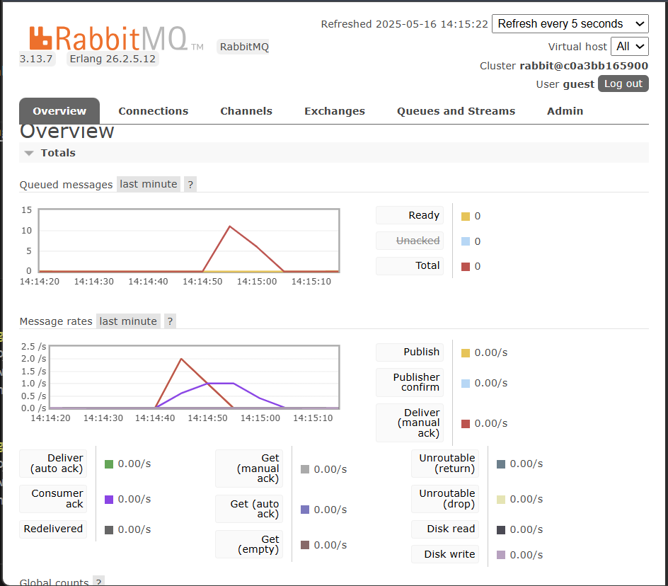
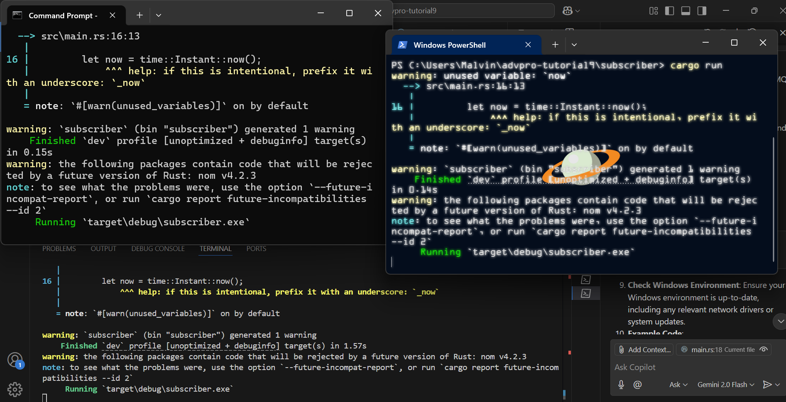
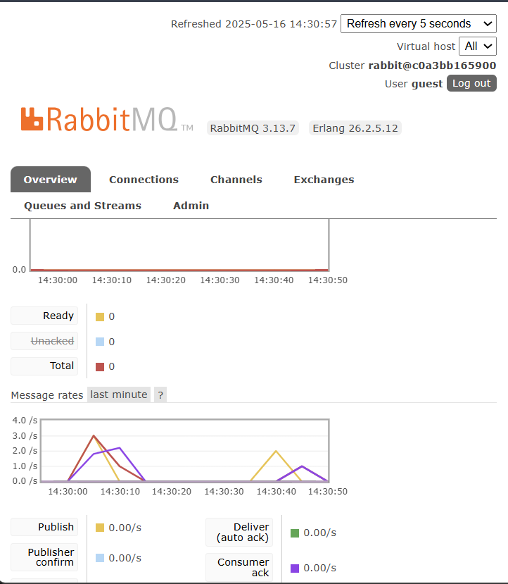
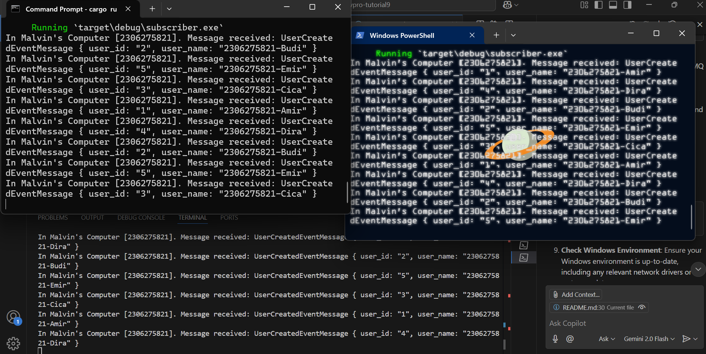

## a. What is AMQP?

**AMQP** stands for **Advanced Message Queuing Protocol**. It is a way for different parts of a program (or different programs) to send messages to each other. It helps systems talk to each other using messages, often through a message broker like **RabbitMQ**.

AMQP is useful because:

* It allows sending and receiving messages without both sides needing to be active at the same time.
* It supports queues to hold messages until they are processed.
* It helps make systems more reliable and easier to scale.

## b. What does `guest:guest@localhost:5672` mean?

This is a way to connect to an AMQP server. Here’s what each part means:

* `guest` (first): the **username**
* `guest` (second): the **password**
* `localhost`: the **address** of the server (in this case, your own computer)
* `5672`: the **port number** RabbitMQ uses for AMQP connections

So this means:

> "Connect to the RabbitMQ server running on my computer (localhost), using the username `guest` and password `guest`, on port 5672."

## Screenshot of slow subscriber simulation

The chart displays a rise in published messages (yellow), but this increase isn’t completely mirrored by a corresponding rise in delivered or acknowledged messages (purple). This indicates that the subscriber is handling messages at a slower rate than the publisher is sending them. Consequently, 16 messages remain in the system in an "Unacked" state, meaning they’ve been delivered but have yet to be acknowledged by the consumer.

From the execution logs and the RabbitMQ dashboard, it’s evident that two subscriber instances were launched, each receiving a distinct portion of the messages sent by the publisher. The message rate chart displays overlapping red (publish) and purple (consumer acknowledgment) spikes, reflecting continuous message transmission and confirmation. The presence of two consumer connections and the absence of queued messages confirm that all messages were promptly delivered and handled, with the workload efficiently shared between the two subscribers.